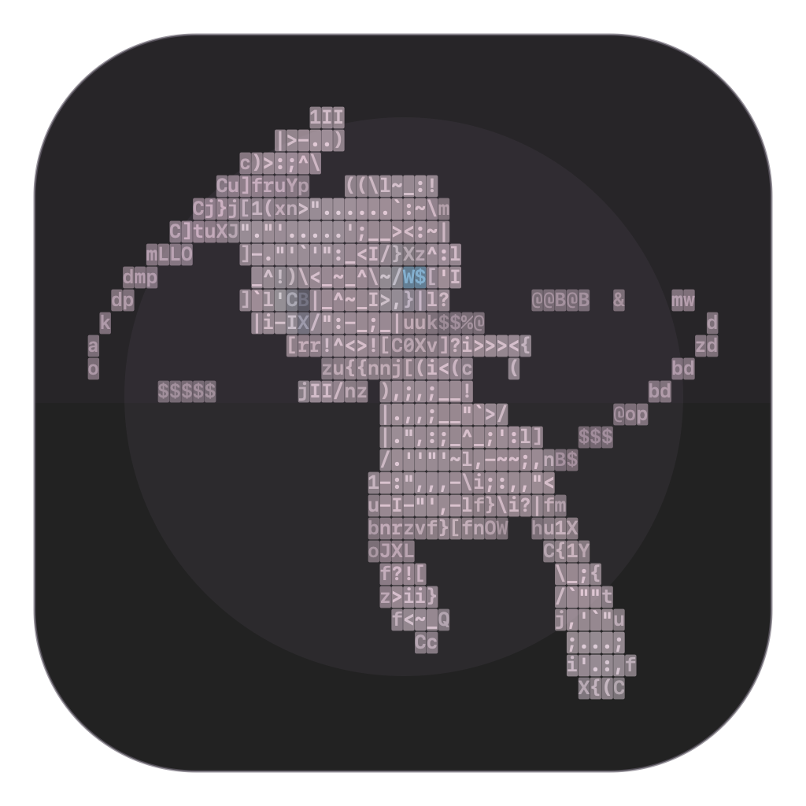

<p align="center">
  
</p>

<h1 align="center">Mew</h1>

<p align="center">A native macOS terminal, and a workspace you can make your own.</p>

<p align="center"><strong>Apple silicon · macOS 14 or later · Homebrew distribution</strong></p>

Mew runs your interactive shell in a pseudoterminal. Your usual commands, aliases, shell configuration, and interactive programs work alongside tabs, split panes, searchable history, and appearance controls.

## Install

On an Apple silicon Mac running **macOS 14 Sonoma or later**, install Mew with [Homebrew](https://brew.sh/):

```sh
brew install --cask importkaizen/mew/mew
```

Open **Mew** from Applications or Spotlight. The Homebrew cask installs the current Apple silicon build and checks its SHA-256 hash against [the cask definition](Casks/mew.rb).

### Download without Homebrew

[Download the current macOS ZIP](https://raw.githubusercontent.com/importkaizen/homebrew-mew/main/dist/Mew-0.1.7-macOS-AppleSilicon.zip), extract it, and move `Mew.app` to Applications. Manual installations are updated by replacing the app with a newer ZIP from this repository.

## What Mew includes

| Feature | What it does |
| --- | --- |
| Real shell sessions | Runs your configured shell with normal command execution, history, ANSI output, and interactive programs. |
| Tabs and split panes | Keeps independent shell sessions open. Split right or down, drag the divider to resize, and click a pane to type in it. |
| Profiles | Saves a shell executable, starting folder, and optional startup command. |
| History and suggestions | Searches your shell history and offers inline command suggestions that you can turn off. |
| Command palette and Focus Mode | Finds Mew actions quickly, or hides the header and tabs when you want only the terminal. |
| Appearance settings | Offers five themes, editable colors, caret styles, text sizes, and built-in or imported fonts. |
| Clickable output | Opens URLs and existing file paths from terminal output. |

Open **Settings** with **⌘,** to customize Mew or change its keyboard shortcuts.

## Quick reference

The default zsh session includes these commands:

| Command | Action |
| --- | --- |
| `help` | Show Mew's guide to commands and features. |
| `help <command>` | Open that command's manual page. |
| `credits` | Show the creator credit. |
| `clear` | Clear output and bring the Mew portrait back to the top. |

Default keyboard shortcuts:

| Shortcut | Action |
| --- | --- |
| **⌘T** | New tab |
| **⌘⇧P** | Shell profiles |
| **⌘⇧H** | Search history |
| **⌘⇧K** | Command palette |
| **⌘,** | Settings |
| **⌘⇧F** | Toggle Focus Mode |
| **⌃⌥Space** | Toggle command suggestions |

Press **→** to accept an inline suggestion. Shortcuts can be edited in **Settings → Keyboard shortcuts**.

## Update or remove

```sh
brew update
brew upgrade --cask mew
```

To remove the Homebrew installation:

```sh
brew uninstall --cask mew
```

If Homebrew reports that Mew is current but the app still shows an older version, quit Mew and run `brew reinstall --cask mew`. Then open the copy in **/Applications**; an older Dock shortcut or manually installed copy may point elsewhere. You can compare Homebrew's version with the app bundle:

```sh
brew info --cask mew
/usr/libexec/PlistBuddy -c 'Print :CFBundleShortVersionString' /Applications/Mew.app/Contents/Info.plist
```

## First launch and release integrity

The current build is **ad hoc signed and not Apple notarized**. macOS may ask you to approve it before the first launch. After trying to open Mew, follow [Apple's Open Anyway instructions](https://support.apple.com/102445) if you trust the download.

The versioned app archives are in [`dist/`](dist/). Each release's SHA-256 value is recorded in [`Casks/mew.rb`](Casks/mew.rb); Homebrew verifies that hash during installation. This repository contains the Homebrew cask and packaged macOS builds.

## Support

Found a bug? [Open an issue](https://github.com/importkaizen/homebrew-mew/issues) with your Mew version, macOS version, installation method, what you expected, what happened, and steps to reproduce it. Include the exact error message or a crash report when relevant, with personal details removed.


built with love
